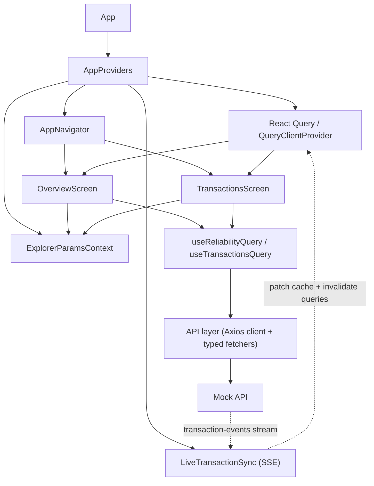

# Reliability Index Explorer App

## Project Overview

This project is an Expo / React Native frontend for exploring a user's reliability score and the transaction activity behind it. The app is split into two main views:

- `Overview` presents the reliability index, score drivers, risk signals, and a monthly cashflow summary.
- `Transactions` exposes the raw transaction window with filters for category, direction, merchant search, and sort order.

## Setup Instructions

### Prerequisites

- Node.js and Yarn
- Expo tooling available locally
- A running mock backend that serves the reliability and transaction endpoints on port `3004`
- A simulator, emulator, or device if you want to run native builds

### Install dependencies

```bash
yarn install
```

### Configure the API host

The frontend API host is configured in `src/config/api.ts`.

Current default:

```ts
export const API_BASE_URL = "http://127.0.0.1:3004";
```

This works for localhost-style development, but it is not universally correct across devices:

- iPhone simulator can usually reach `127.0.0.1`
- Android emulators or physical devices typically need your machine's LAN IP instead

If the app cannot reach the backend, update `API_BASE_URL` before running the frontend.

## How To Run

Start the Expo dev server:

```bash
yarn start
```

Run native targets:

```bash
yarn ios
yarn android
```

Run the available validation gate:

```bash
yarn typecheck
yarn test
```

Important: the mock backend must already be running, otherwise the UI will load but all data requests will fail.

## Architecture Notes

### Frontend structure

The codebase is organized by responsibility:

- `src/api` contains the typed API client and resource fetchers
- `src/components` contains reusable presentation building blocks such as cards, rows, and state placeholders
- `src/context` contains shared analyst query parameters
- `src/features/transactions` contains transaction-specific behavior, including filter logic and live sync
- `src/hooks` wraps data fetching behind resource-specific query hooks
- `src/screens` contains the two screen-level orchestrators

This separates screen composition, presentation, and data access concerns.

### State management decisions

State is split by ownership:

- React Query manages server state for reliability snapshots and transaction windows
- `ExplorerParamsContext` stores the shared analyst inputs that both screens depend on: `userId`, `scoreFrom`, and the derived transaction window
- local component state is used for transient UI concerns such as filter selections, search input, date picker visibility, and form drafts

This keeps shared client state limited to the parameters both screens depend on.

### Data fetching strategy

The data flow is:

1. screen reads shared params from context
2. screen calls resource-specific React Query hooks
3. hooks call typed fetch functions in the API layer
4. API functions use a shared Axios client configured with `API_BASE_URL`

Additional details:

- query keys are parameterized by `userId` and date window so caches stay scoped to the active analyst query
- `placeholderData` keeps previous data visible during parameter transitions
- `LiveTransactionSync` opens an SSE connection while the app is active, patches the cached transaction list, and then invalidates both transaction and reliability queries

### Component design approach

The component design is compositional and screen-driven:

- screens fetch data, derive display-specific values, and decide which state cards to show
- cards such as score, breakdown, chart, explanation, and filters encapsulate presentation chunks
- shared empty/loading/error cards standardize async states across screens
- utility helpers derive chart data, date ranges, formatting, and transaction filtering outside of presentational components

This keeps most UI components focused on presentation, with orchestration concentrated in the two screens.

## Diagram



The key architectural point is that screens do not talk to the backend directly. They read context, consume query hooks, and render derived UI state. Live updates come in through SSE, update the React Query cache, and then trigger normal query refreshes.

## Assumptions

- the default analyst context is `user_123` with a score anchor date of `2026-02-20`
- the transaction analysis window is derived from the score anchor and spans one year, ending one day before the same calendar date in the following year
- the backend returns stable response shapes for reliability data, transactions, and transaction events
- the transaction live-sync endpoint is available when the app is active
- the current transaction screen effectively assumes `EUR`, while the overview cashflow chart can use the backend-provided currency

## Trade-offs

- a narrow React context is used for shared analyst parameters instead of introducing Redux, Zustand, or a broader app store
- React Query is treated as the primary data-state mechanism because remote data dominates the app's behavior
- screen components own orchestration and view-model derivation, which keeps child components simpler but makes screens heavier
- SSE handling updates the transactions cache directly and then invalidates related queries, which is simpler than maintaining a normalized real-time store
- the API host is hardcoded in source for demo speed, not for deployment flexibility

## Limitations

- there is no environment-based configuration for the API base URL
- there is no authentication, authorization, or persistent user session concept
- there is no offline cache or persistence layer
- locale handling is limited and not fully consistent across the UI
- chart summaries and transaction filters depend on frontend-derived calculations over backend-provided transaction data
- explanation output is partly heuristic on the client: positive signals come from backend drivers, but risk signals are derived from metrics in the UI layer

## AI Usage Disclosure

AI tooling was used during development and documentation in the following ways:

- to help establish the initial project baseline, including parts of the test setup and the basic app structure
- as a sparring partner when evaluating implementation improvements and documentation changes
- to review and validate test plans before finalizing them

All final decisions, code checks, and repository-specific documentation statements were reviewed against the actual implementation in this repository.
